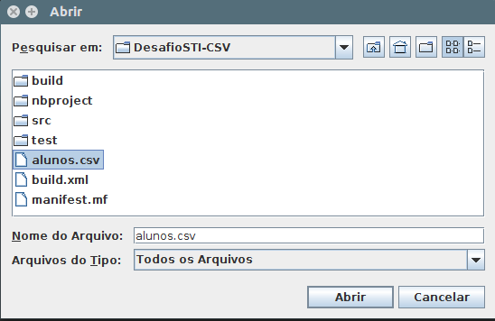
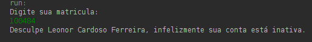
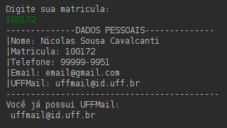
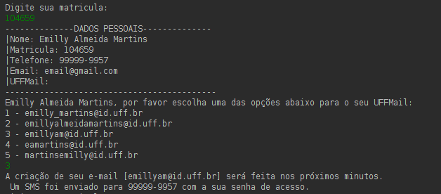
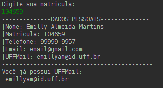

## Desafio 1 - UFFMail

* [Código-Fonte](https://github.com/romulomourao/desafio-sti/DesafioSTI-CSV)
- Escolha o arquivo com as informações.

#### Matrículas Inativas
- Caso a matrícula digitada estiver **INATIVA** será exibida a seguinte mensagem:

#### Matrículas Ativas
- Caso já exista um UFFMail criado para uma matrícula, será exibida a seguinte mensagem:  

- Caso **não** exista um UFFMail criado para uma matrícula, será exibida a seguinte mensagem:  

- Caso seja digitada a mesma matrícula após a criação do UFFMail, será exibida a mensagem:   

---

## Desafio 2 - BikeRio

* [Código-Fonte](https://github.com/romulomourao/desafio-sti/tree/gh-pages)

* [Aplicação Rodando](https://rmourao.com.br/desafio-sti)
