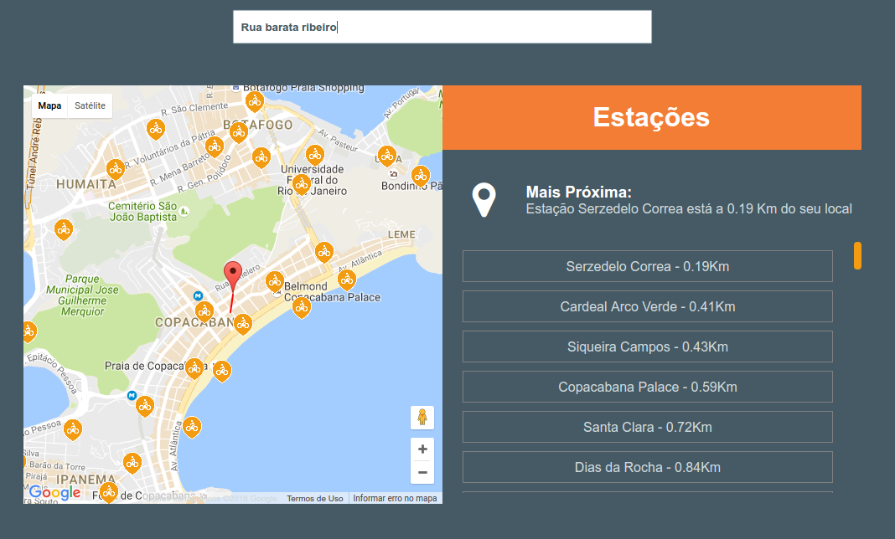

## Desafio 1 - UFFMail

* [Código-Fonte](https://github.com/romulomourao/desafio-sti/tree/master/DesafioSTI-CSV)
- Escolha o arquivo com as informações.

#### Matrículas Inativas
- Caso a matrícula digitada estiver **INATIVA** será exibida a seguinte mensagem:

#### Matrículas Ativas
- Caso já exista um UFFMail criado para uma matrícula, será exibida a seguinte mensagem:  

- Caso **não** exista um UFFMail criado para uma matrícula, será exibida a seguinte mensagem:  

- Caso seja digitada a mesma matrícula após a criação do UFFMail, será exibida a mensagem:   

---

## Desafio 2 - BikeRio

* [Código-Fonte](https://github.com/romulomourao/desafio-sti/tree/gh-pages)

* [Aplicação Rodando](http://rmourao.com.br/desafio-sti)

**OBS: Só funciona para a cidade do Rio de Janeiro**

- Você só precisa digitar o nome da rua e dar ENTER, apenas o nome da rua sem complementos. Ex: Avenida Rio Branco

- O mapa mostrará um marcador vermelho que indicará sua posição e vários marcadores amarelos representando as estações. Uma linha vermelha será traçada indicando a estação mais próxima.

- Ao lado do mapa será mostrado a distancia e o nome da estação mais próxima e uma lista ordenada das estações mais próximas.

